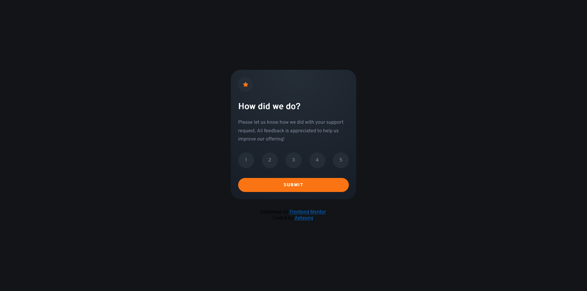

# Frontend Mentor - Interactive rating component solution

This is a solution to the [Interactive rating component challenge on Frontend Mentor](https://www.frontendmentor.io/challenges/interactive-rating-component-koxpeBUmI). Frontend Mentor challenges help you improve your coding skills by building realistic projects. 

## Table of contents

- [Overview](#overview)
  - [The challenge](#the-challenge)
  - [Screenshot](#screenshot)
  - [Links](#links)
- [My process](#my-process)
  - [Built with](#built-with)
  - [What I learned](#what-i-learned)
  - [Continued development](#continued-development)
  - [Useful resources](#useful-resources)
- [Author](#author)
- [Acknowledgments](#acknowledgments)

## Overview

### The challenge

Users should be able to:

- View the optimal layout for the app depending on their device's screen size
- See hover states for all interactive elements on the page
- Select and submit a number rating
- See the "Thank you" card state after submitting a rating

### Screenshot



### Links

- Solution URL: [Add solution URL here](https://github.com/Aeteung/interactive-rating-component-main)
- Live Site URL: [Add live site URL here](https://aeteung.github.io/interactive-rating-component-main/)

## My process

### Built with

- Semantic HTML5 markup
- CSS custom properties
- Flexbox
- CSS Grid
- [React](https://reactjs.org/) - JS library
- SCSS with React
- useState in React

### What I learned

- Import svg as background-image via css
```css
.container > .stage1 > .star-icon {
    background: url('data:image/svg+xml;utf-8,<svg width="17" height="16" xmlns="http://www.w3.org/2000/svg"><path d="m9.067.43 1.99 4.031c.112.228.33.386.58.422l4.45.647a.772.772 0 0 1 .427 1.316l-3.22 3.138a.773.773 0 0 0-.222.683l.76 4.431a.772.772 0 0 1-1.12.813l-3.98-2.092a.773.773 0 0 0-.718 0l-3.98 2.092a.772.772 0 0 1-1.119-.813l.76-4.431a.77.77 0 0 0-.222-.683L.233 6.846A.772.772 0 0 1 .661 5.53l4.449-.647a.772.772 0 0 0 .58-.422L7.68.43a.774.774 0 0 1 1.387 0Z" fill="%23FC7614"/></svg>') 
    center no-repeat black;
}
```

- Use setInterval to animate element 
```js
setInterval(() => {
            if (main.style.opacity < 1) {
                tf-=10/(60*animationTime)
                main.style.transform = `translateY(${tf}px)`
                main.style.opacity = parseFloat(main.style.opacity)+1/(60*animationTime)
            }
        }, parseInt`${1000/60}`)
```

### Continued development

Design projects in React as I originally planned to complete this project with vanilla JS. That's why I simply put my whole html into my js as JSX without any transformation.

### Useful resources

- [Figma](https://www.figma.com/) - This helped me to style my project precisely as I can measure the color and the padding.
- [Beginner's React Tutorial](https://www.youtube.com/watch?v=bMknfKXIFA8&ab_channel=freeCodeCamp.org) - This is an amazing tutorial which helped me finally understand React. I'd recommend it to anyone still learning this concept.

## Author

- Frontend Mentor - [@Aeteung](https://www.frontendmentor.io/profile/Aeteung)

